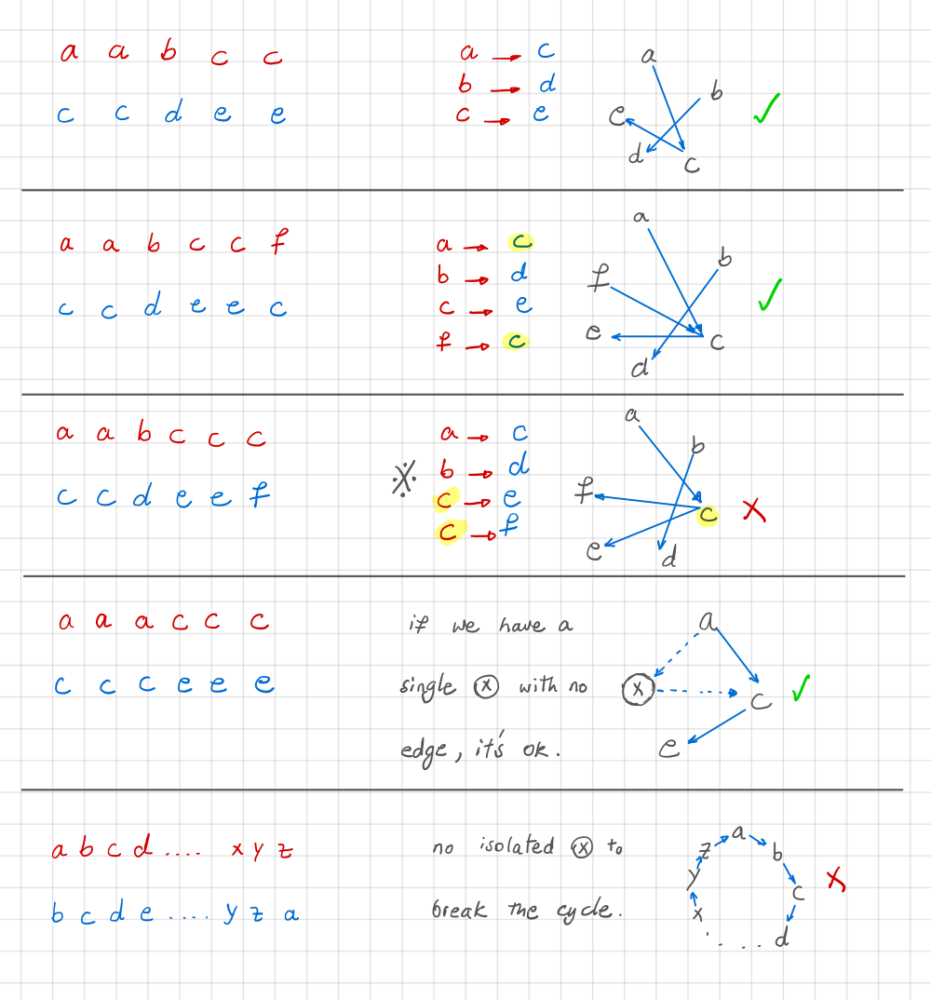

 String Transforms Into Another String (Leetcode #1153)
===============================
### Hard

Given two strings `str1` and `str2` of the same length, determine whether you can transform `str1` into `str2` by doing zero or more conversions.

In one conversion you can convert all occurrences of one character in `str1` to any other lowercase English character.

Return true if and only if you can transform `str1` into `str2`.

 

### Example 1:

```
Input: str1 = "aabcc", str2 = "ccdee"
Output: true
Explanation: Convert 'c' to 'e' then 'b' to 'd' then 'a' to 'c'. Note that the order of conversions matter.
```

### Example 2:
```
Input: str1 = "leetcode", str2 = "codeleet"
Output: false
Explanation: There is no way to transform str1 to str2.
 ```

### Note:
```
1 <= str1.length == str2.length <= 10^4
Both str1 and str2 contain only lowercase English letters.
```

Solution
========


```python
class Solution:
    def canConvert(self, str1: str, str2: str) -> bool:
        if str1 == str2: return True
        if len(str1) != len(str2): return False
        
        # case 1: one-to-many => xx -> ab
        table = {}
        for i, x in enumerate(str1):
            if table.setdefault(x, str2[i]) != str2[i]:
                return False
            
        # case 2: cycle without singleton character
        # abcd...xyz -> bcd...yza
        # it means that we have all 26 chars in str2.
        # since str1 != str2 that means we have a cycle
        # and no singleton char to break it.
        return len(set(str2)) != 26
```
