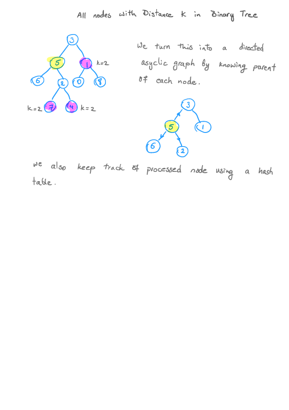

All Nodes Distance K in Binray Tree (Leetcode #863)
===============================
### Medium
We are given a binary tree (with root node root), a target node, and an integer value K.

Return a list of the values of all nodes that have a distance K from the target node.  The answer can be returned in any order.

### Example 1:
Input: root = [3,5,1,6,2,0,8,null,null,7,4], target = 5, K = 2

Output: [7,4,1]

### Explanation:
The nodes that are a distance 2 from the target node (with value 5)
have values 7, 4, and 1.


Note that the inputs "root" and "target" are actually TreeNodes.
The descriptions of the inputs above are just serializations of these objects.


### Note:

The given tree is non-empty.
Each node in the tree has unique values 0 <= node.val <= 500.
The target node is a node in the tree.
0 <= K <= 1000.

Solution
========


```python
# Definition for a binary tree node.
# class TreeNode:
#     def __init__(self, x):
#         self.val = x
#         self.left = None
#         self.right = None

class Solution:
    def distanceK(self, root: TreeNode, target: TreeNode, K: int) -> List[int]:
        if root is None:
            return []

        parent_map = {}
        self.fillParentMap(parent_map, root, None)
        curr_level = 0

        # BFS
        queue = [target]
        seen = {target: 1}
        while queue:
            if curr_level == K:
                return [q.val for q in queue]
            for i in range(len(queue)):
                q = queue.pop(0)
                if q.left and q.left not in seen:
                    seen[q.left] = 1
                    queue.append(q.left)
                if q.right and q.right not in seen:
                    seen[q.right] = 1
                    queue.append(q.right)
                parent = parent_map.get(q)
                if parent and parent not in seen:
                    seen[parent] = 1
                    queue.append(parent)
            curr_level += 1
        return []


    def fillParentMap(self, parent_map, root, parent):
        if root is None:
            return
        parent_map[root] = parent
        self.fillParentMap(parent_map, root.left, root)
        self.fillParentMap(parent_map, root.right, root)

```
