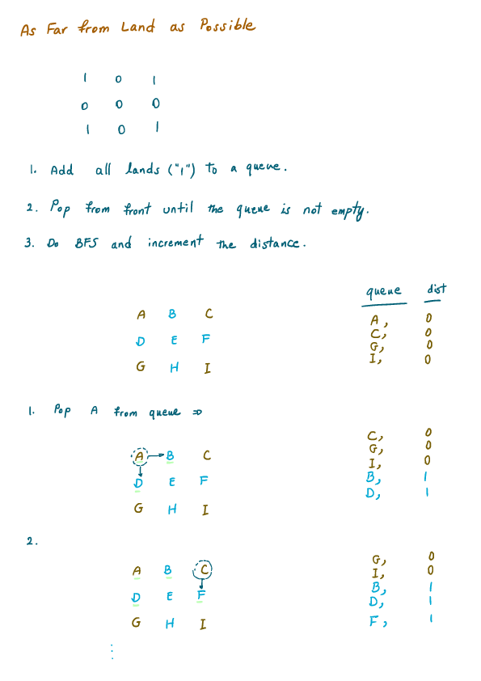

As Far from Land as Possible (Leetcode #1162)
===============================
### Medium

Given an N x N grid containing only values 0 and 1, where 0 represents water and 1 represents land, find a water cell such that its distance to the nearest land cell is maximized and return the distance.

The distance used in this problem is the Manhattan distance: the distance between two cells (x0, y0) and (x1, y1) is |x0 - x1| + |y0 - y1|.

If no land or water exists in the grid, return -1.

### Example 1:
```
1  0  1
0  0  0
1  0  1
```
```
Input: [[1,0,1],[0,0,0],[1,0,1]]
Output: 2
```
Explanation:

The cell `(1, 1)` is as far as possible from all the land with distance `2`.

### Example 2:

```
1  0  0
0  0  0
0  0  0
```
```
Input: [[1,0,0],[0,0,0],[0,0,0]]
Output: 4
```
Explanation:

The cell `(2, 2)` is as far as possible from all the land with distance `4`.

### Note:
```
1 <= grid.length == grid[0].length <= 100
grid[i][j] is 0 or 1
```

Solution
========


```python
import queue

class Solution:
    def maxDistance(self, grid: List[List[int]]) -> int:
        rows = len(grid)
        cols = len(grid[0]) if rows else 0
        if rows == 0 or cols == 0:
            return -1

        visited = [[0 for _ in range(cols)] for _ in range(rows)]
        q = deque()
        max_dist = -1

        for i in range(rows):
            for j in range(cols):
                if grid[i][j] == 1:
                    q.append((i, j, 0))
        if not q or len(q) == rows*cols:
            return -1

        while q:
            (i, j, dist) = q.popleft()
            max_dist = max(max_dist, dist)
            visited[i][j] = 1
            for dx, dy in [[-1, 0],[1, 0],[0, 1],[0, -1]]:
                x, y = i+dx, j+dy
                if x < 0 or y < 0 or x >= len(grid) or y >= len(grid[0]) or visited[x][y] == 1:
                    continue
                visited[x][y] = 1
                q.append((x, y, dist+1))

        return max_dist if max_dist > 0 else -1
```
