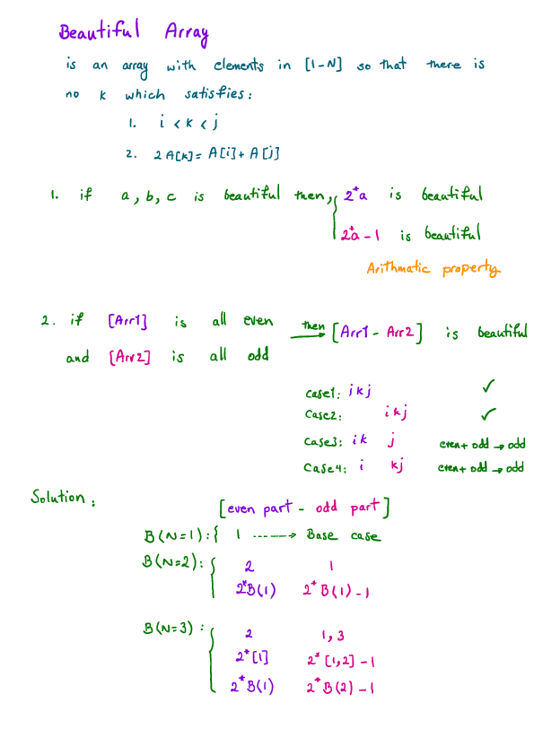

Beautiful Array (Leetcode #932)
===============================
### Medium
For some fixed `N`, an array `A` is beautiful if it is a permutation of the integers `1, 2, ..., N`, such that:

For every `i < j`, there is no `k` with `i < k < j` such that `A[k] * 2 = A[i] + A[j]`.

Given `N`, return any beautiful array `A`.  (It is guaranteed that one exists.)

### Example 1:
```
Input: 4
Output: [2,1,4,3]
```

### Example 2:
```
Input: 5
Output: [3,1,2,5,4]
```

### Note:

`1 <= N <= 1000`

Solution
========

```python
# O(N)
class Solution:
    def beautifulArray(self, N):
        def beautiful(N, memo):
            if memo.get(N):
                return memo[N]
            # B(N=3) -> [even part]-[odd part]
            #                2     -   1, 3
            #               2*1    -  2*[1,2]-1
            #              2*B(1)  -  2*B(2)-1
            to_be_even = self.beautifulArray(N//2)
            to_be_odd = self.beautifulArray((N+1)//2)
            return [2*e for e in to_be_even] + [2*o-1 for o in to_be_odd]

        memo = {1:[1]}  # B(1) = [1]
        return beautiful(N, memo)
```
