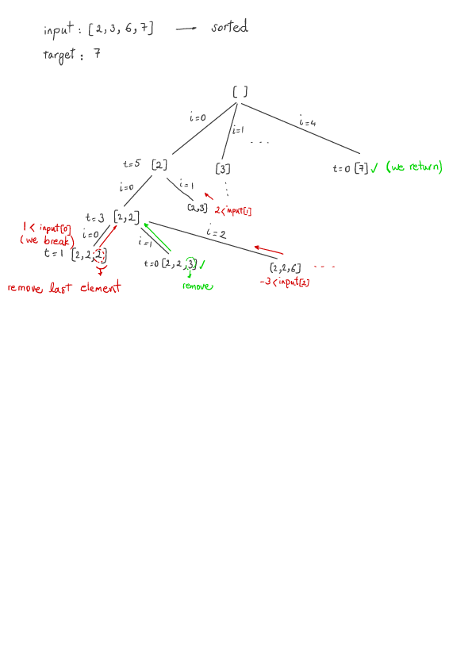

Combination Sum (Leetcode #39)
===============================
### Medium
Given a set of candidate numbers (candidates) (without duplicates) and a target number (target), find all unique combinations in candidates where the candidate numbers sums to target.

The same repeated number may be chosen from candidates unlimited number of times.

Note:

All numbers (including target) will be positive integers.

The solution set must not contain duplicate combinations.
### Example 1:

Input: `candidates = [2,3,6,7], target = 7`,
A solution set is:
```
[
  [7],
  [2,2,3]
]
```

### Example 2:

Input: `candidates = [2,3,5], target = 8`,
A solution set is:
```
[
  [2,2,2,2],
  [2,3,3],
  [3,5]
]
```
Solution
========


```python
class Solution:
    def combinationSum(self, candidates: List[int], target: int) -> List[List[int]]:
        if len(candidates) == 0:
            return []
        candidates.sort()
        results = []
        result = []
        self.dfs(candidates, target, result, results, 0)
        return results

    def dfs(self, candidates, target, result, results, start):
        if target == 0:
            results.append(result.copy())
            return
        for i in range(start, len(candidates)):
            if candidates[i] > target:
                break
            result.append(candidates[i])
            self.dfs(candidates, target-candidates[i], result, results, i)
            result.pop(len(result)-1)  # remove last element and backtrack

```
