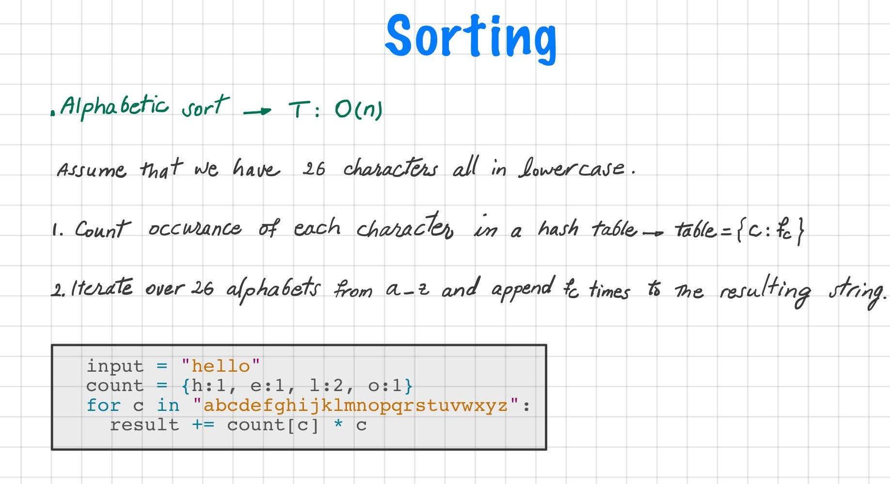

Custom Sort String (Leetcode #793)
===============================
### Medium
`S` and `T` are strings composed of lowercase letters. In `S`, no letter occurs more than once.

`S` was sorted in some custom order previously. We want to permute the characters of `T` so that they match the order that `S` was sorted. More specifically, if `x` occurs before `y` in `S`, then `x` should occur before y in the returned string.

Return any permutation of `T` (as a string) that satisfies this property.

### Example:
```
Input: 
S = "cba"
T = "abcd"
Output: "cbad"
```
### Explanation: 
`a`, `b`, `c` appear in `S`, so the order of `a`, `b`, `c` should be `c`, `b`, and `a`. 

Since `d` does not appear in `S`, it can be at any position in `T`. `dcba`, `cdba`, `cbda` are also valid outputs.

### Note:

`S` has length at most `26`, and no character is repeated in `S`.

`T` has length at most `200`.

`S` and `T` consist of lowercase letters only.

Solution
========

```python
# # T: O(nlog(n))
# import functools
# class Solution:
#     def compare(self, c1, c2):
#         return self.map[c1] - self.map[c2]
    
#     def customSortString(self, S: str, T: str) -> str:
#         self.map = {c:0 for c in 'abcdefghijklmnopqrstuvwxyz'}
#         for i in range(len(S)):
#             self.map[S[i]]= i 
#         sorted_chars = sorted(T, key=functools.cmp_to_key(self.compare))
#         return ''.join(sorted_chars)
    
# T: O(n)
class Solution:
    def customSortString(self, S: str, T: str) -> str:
        res = ''
        a = ord('a')

        # Use an 'ordered' hash map to count frequency of chars in S.
        counter = 26*[0]  
        for t in T:
            counter[ord(t)-a] += 1

        # Add chars seen in S (in order).
        for s in S:
            res += counter[ord(s)-a] * s
            counter[ord(s)-a] = -1  # mark as added.

        # Add chars not seen in S and not already added.
        for i in range(len(counter)):
            count = counter[i]
            if count != -1:  # if not added already.
                res += count * chr(i+a)
        return res
```
