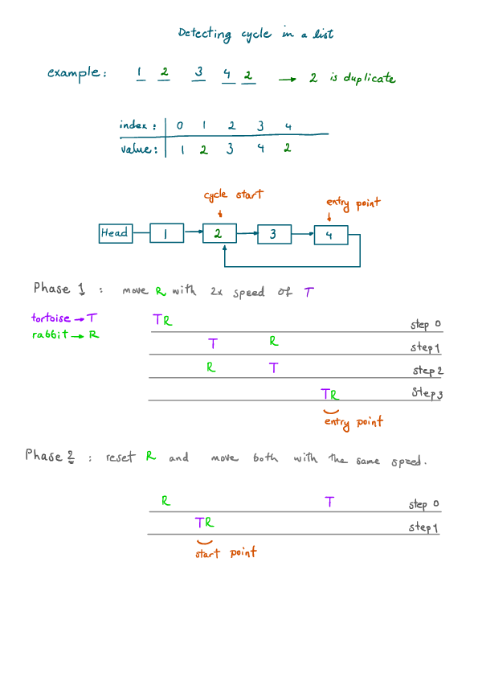

Find the Duplicate Number (Leetcode #287)
===============================
### Medium

Given an array nums containing n + 1 integers where each integer is between 1 and n (inclusive), prove that at least one duplicate number must exist. Assume that there is only one duplicate number, find the duplicate one.

### Example 1:
```
Input: [1,3,4,2,2]
Output: 2
```

### Example 2:
```
Input: [3,1,3,4,2]
Output: 3
```

### Note:
+ You must not modify the array (assume the array is read only).
+ You must use only constant, O(1) extra space.
+ Your runtime complexity should be less than O(n2).
+ There is only one duplicate number in the array, but it could be repeated more than once.

Solution
========


```python
class Solution:
    def findDuplicate(self, nums: List[int]) -> int:
        p_slow = nums[0]
        p_fast = nums[0]

        # take the first step
        p_slow = nums[p_slow]
        p_fast = nums[nums[p_fast]]

        # keep stepping until two pointers have the same value.
        # this is the entry point to the cycle.
        while p_slow != p_fast:
            p_slow = nums[p_slow]
            p_fast = nums[nums[p_fast]]

        # now we reset fast pointer and step them with the same pace.
        p_fast = nums[0]
        while p_slow != p_fast:
            p_slow = nums[p_slow]
            p_fast = nums[p_fast]

        return p_slow

```
