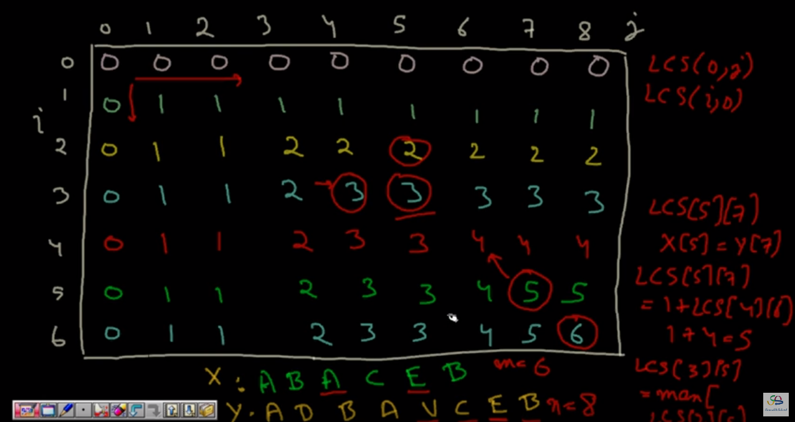

Longest Common Subsequence (Leetcode #1143)
===============================
### Medium

Given two strings text1 and text2, return the length of their longest common subsequence.

A subsequence of a string is a new string generated from the original string with some characters(can be none)
deleted without changing the relative order of the remaining characters.
(eg, "ace" is a subsequence of `"abcde"` while `"aec"` is not). A common subsequence of two strings is a
subsequence that is common to both strings.

If there is no common subsequence, return `0`.

### Example 1:
```
Input: text1 = `"abcde", text2 = "ace" `
Output: `3`
Explanation: The longest common subsequence is `"ace"` and its length is `3`.
```
### Example 2:
```
Input: `text1 = "abc", text2 = "abc"`
Output: `3`
Explanation: The longest common subsequence is `"abc"` and its length is `3`.
```
### Example 3:
```
Input: `text1 = "abc", text2 = "def"`
Output: `0`
Explanation: There is no such common subsequence, so the result is `0`.
```
### Constraints:
```
1 <= text1.length <= 1000
1 <= text2.length <= 1000
The input strings consist of lowercase English characters only.
```
Solution
========

### Recursion:
```
LCS(i, j) {
  if (i >= len(A) OR j >= len(B)):
    return 0;
  if (A[i] == B[j]):
    return 1 + LCS(i+1, j+1);
  else:
    return MAX(LCS(i+1, j), LCS(i, j+1))
}
```
```python
T: O(M*N)
S: O(M*N)
from functools import lru_cache
class Solution:
    
    def longestCommonSubsequence(self, text1: str, text2: str) -> int:
        L1 = len(text1)
        L2 = len(text2)
        
        @lru_cache(maxsize=None)
        def lcs(i, j): 
            if i >= L1 or j >= L2:
                return 0
            if text1[i] == text2[j]:
                return 1 + lcs(i+1, j+1)
            else:
                return max(lcs(i+1, j), lcs(i, j+1))
        return lcs(0, 0)
```
```python
T: O(M*N^2)
S: O(M*N)
from functools import lru_cache
class Solution:
    
    def longestCommonSubsequence(self, text1: str, text2: str) -> int:
        L1 = len(text1)
        L2 = len(text2)
        
        @lru_cache(maxsize=None)
        def lcs(i, j): 
            if i >= L1 or j >= L2:
                return 0
            case1 = lcs(i+1, j)
            case2 = 0
            occ = text2.find(text1[i], j)
            if occ != -1:
                case2 = 1 + lcs(i+1, occ+1)
            return max(case1, case2)
        return lcs(0, 0)
```
### Memoization:


```python
T: O(M*N)
S: O(M*N)
class Solution:
    def longestCommonSubsequence(self, text1: str, text2: str) -> int:

        n = len(text1)
        m = len(text2)

        if not m or not n:
            return 0

        mat = [[0 for x in range(m+1)] for y in range(n+1)]

        y = 1
        while y < n+1:
            x = 1
            while x < m+1:
                if text1[y-1] == text2[x-1]:
                    mat[y][x] = mat[y-1][x-1] + 1
                else:
                    mat[y][x] = max(mat[y-1][x], mat[y][x-1])
                x += 1
            y += 1
        return mat[n][m]

```
