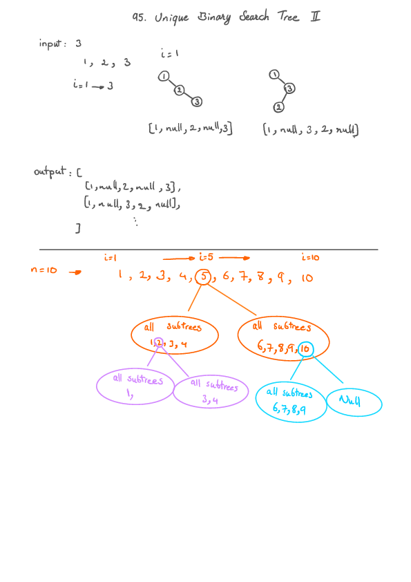

Unique Binray Search Tree II (Leetcode #95)
===============================
### Medium

Given an integer n, generate all structurally unique BST's (binary search trees) that store values 1 ... n.

### Example:

```
Input: 3
Output:
[
  [1,null,3,2],
  [3,2,null,1],
  [3,1,null,null,2],
  [2,1,3],
  [1,null,2,null,3]
]
```
### Explanation:
The above output corresponds to the 5 unique BST's shown below:
```

   1         3     3      2      1
    \       /     /      / \      \
     3     2     1      1   3      2
    /     /       \                 \
   2     1         2                 3
```

Solution
========

```python
# Definition for a binary tree node.
# class TreeNode:
#     def __init__(self, x):
#         self.val = x
#         self.left = None
#         self.right = None

class Solution:
    def generateTrees(self, n: int) -> List[TreeNode]:
        if n == 0:
            return []
        return self._generateTrees(1, n)

    def _generateTrees(self, start: int, end: int) -> List[TreeNode]:
        vec = []
        if start > end:
            vec.append(None)
            return vec

        for i in range(start, end+1):
            left_subtree = self._generateTrees(start=start, end=i-1)
            right_subtree = self._generateTrees(start=i+1, end=end)
            for l in left_subtree:
                for r in right_subtree:
                    node = TreeNode(i)
                    node.left = l
                    node.right = r
                    vec.append(node)
        return vec
```
