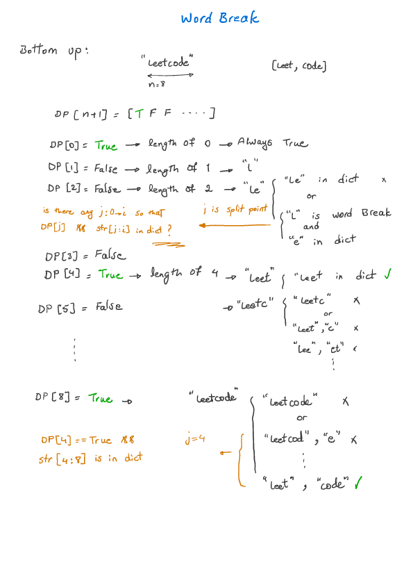
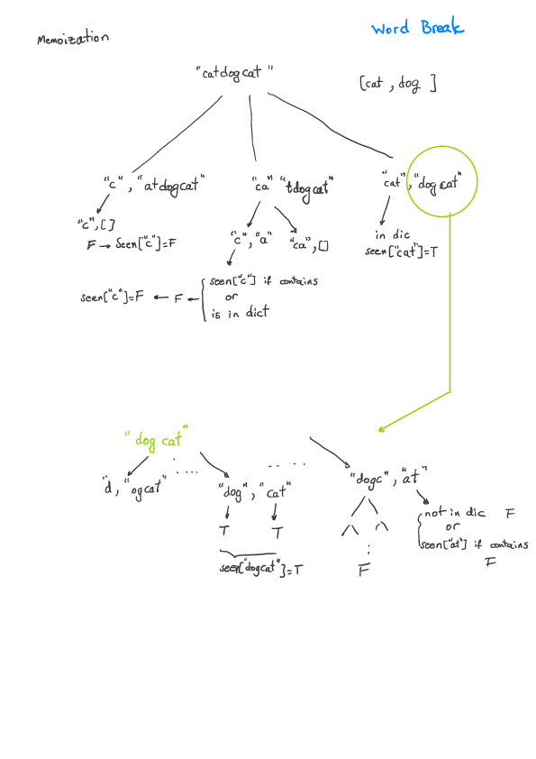

Word Break (Leetcode #139)
===============================
### Medium

Given a non-empty string s and a dictionary wordDict containing a list of non-empty words, determine if s can be segmented into a space-separated sequence of one or more dictionary words.

Note:

The same word in the dictionary may be reused multiple times in the segmentation.
You may assume the dictionary does not contain duplicate words.
### Example 1:

```
Input: s = "leetcode", wordDict = ["leet", "code"]
Output: true
```
Explanation: Return true because "leetcode" can be segmented as "leet code".
### Example 2:
```
Input: s = "applepenapple", wordDict = ["apple", "pen"]
Output: true
```
Explanation: Return true because "applepenapple" can be segmented as "apple pen apple".
             Note that you are allowed to reuse a dictionary word.
### Example 3:
```
Input: s = "catsandog", wordDict = ["cats", "dog", "sand", "and", "cat"]
Output: false
```

Solution
========



```python
class Solution:
# O(n^3) (Memoization)
#     def wordBreak(self, s: str, wordDict: List[str]) -> bool:
#         seen = {}
#         return self._wordBreak(s, wordDict, seen)

#     def _wordBreak(self, s: str, wordDict: List[str], seen) -> bool:
#         if s in wordDict:
#             return True
#         if s in seen:
#             return seen[s]
#         for i in range(len(s)):
#             if s[0:i+1] in wordDict and self._wordBreak(s[i+1:], wordDict, seen):
#                 seen[s[i+1:]] = True
#                 return True
#         seen[s] = False
#         return False

# O(n^3) (DP bottom up)
    def wordBreak(self, s: str, wordDict: List[str]) -> bool:
        if s in wordDict:
            return True
        wb = [False for _ in range(0, len(s)+1)]
        wb[0] = True
        for i in range(1, len(s)+1):
            if s[0:i] in wordDict:
                wb[i] = True
                continue
            for j in range(0, i):
                if wb[j] and s[j:i] in wordDict:
                    wb[i] = True
                    break
        return wb[-1]

# O(N^2) (Samle as above using dictionary)
class Solution:
    def wordBreak(self, s: str, wordDict: List[str]) -> bool:
        seen = {}
        table = set()
        for w in wordDict:
            table.add(w)
        return self._wordBreak(s, wordDict, seen, table)
        
    def _wordBreak(self, s, wordDict, seen, table):
        if s in table:
            return True
        if s in seen:
            return seen[s]
        for i in range(len(s)):
            if s[0:i+1] in table and self._wordBreak(s[i+1:], wordDict, seen, table):
                seen[s] = True
                return True
        seen[s] = False
        return False
        
        class TrieNode:
    def __init__(self):
        self.children = {}
        self.isWord = False
        
# O(N*L) (Samle as above using Trie)
class Solution:
    def __init__(self):
        self.root = TrieNode()
        
    def wordBreak(self, s: str, wordDict: List[str]) -> bool:
        for w in wordDict:
            self.add(w)
        seen = {}
        return self._wordBreak(s, seen)
        
    def _wordBreak(self, s, seen):
        if s == "":
            return True
        if s in seen:
            return seen[s]
        p = self.root
        for i in range(len(s)):
            if s[i] not in p.children:
                seen[s] = False
                return False
            p = p.children[s[i]]
            if p.isWord and self._wordBreak(s[i+1:], seen):
                seen[s] = True
                return True
        seen[s] = False
        return False
            
        
    def add(self, word):
        p = self.root
        for c in word:
            if c not in p.children:
                p.children[c] = TrieNode()
            p = p.children[c]
        p.isWord = True
        
```
