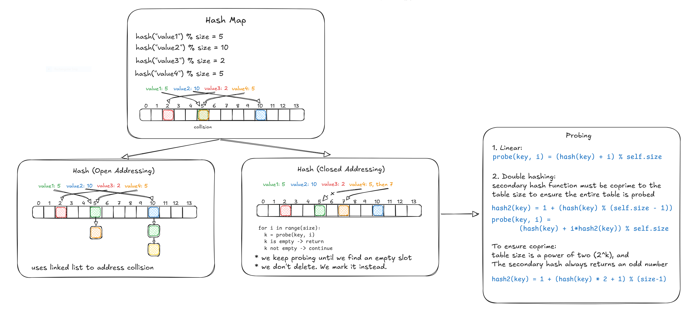

### ClosedAddressingHashTable with linked list

```python
class LinkedListNode:
    def __init__(self, key, value, next=None):
        self.key = key
        self.value = value
        self.next = next

class ClosedAddressingHashTable:
    def __init__(self, size=10):
        self.size = size
        self.table = [None] * size

    def _hash(self, key):
        return hash(key) % self.size

    def insert(self, key, value):
        idx = self._hash(key)
        node = self.table[idx]
        while node:
            if node.key == key:
                node.value = value
                return
            node = node.next
        new_node = LinkedListNode(key, value, self.table[idx])
        self.table[idx] = new_node

    def get(self, key):
        idx = self._hash(key)
        node = self.table[idx]
        while node:
            if node.key == key:
                return node.value
            node = node.next
        return None

    def delete(self, key):
        idx = self._hash(key)
        prev = None
        node = self.table[idx]
        while node:
            if node.key == key:
                if prev:
                    prev.next = node.next
                else:
                    self.table[idx] = node.next
                return True
            prev = node
            node = node.next
        return False

```

### OpenAddressingHashTable with linear and double hash probing

```python
class OpenAddressingHashTable:
    def __init__(self, size=16, method='linear'):
        if not (size != 0 and ((size & (size - 1)) == 0)):
            raise ValueError("Size must be a power of two.")
        self.size = size
        self.table = [None] * size
        self.deleted = object()
        self.method = method

    def _primary_hash(self, key):
        return hash(key) & (self.size - 1)  # Faster than mod if size is power of 2

    def _secondary_hash(self, key):
        # Always return an odd step size
        h = hash(key)
        return (h * 2 + 1) & (self.size - 1) or 1

    def _probe(self, key, i):
        if self.method == 'linear':
            return (self._primary_hash(key) + i) & (self.size - 1)
        elif self.method == 'double':
            return (self._primary_hash(key) + i * self._secondary_hash(key)) & (self.size - 1)
        else:
            raise ValueError("Unsupported probing method")

    def insert(self, key, value):
        for i in range(self.size):
            idx = self._probe(key, i)
            if self.table[idx] is None or self.table[idx] is self.deleted:
                self.table[idx] = (key, value)
                return
            elif self.table[idx][0] == key:
                self.table[idx] = (key, value)
                return
        raise Exception("Hash table is full")

    def get(self, key):
        for i in range(self.size):
            idx = self._probe(key, i)
            if self.table[idx] is None:
                return None
            if self.table[idx] is not self.deleted and self.table[idx][0] == key:
                return self.table[idx][1]
        return None

    def delete(self, key):
        for i in range(self.size):
            idx = self._probe(key, i)
            if self.table[idx] is None:
                return False
            if self.table[idx] is not self.deleted and self.table[idx][0] == key:
                self.table[idx] = self.deleted
                return True
        return False

```
